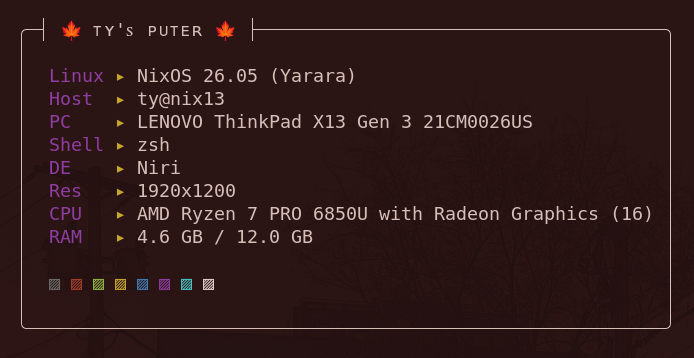

# My NixOS Configuration

This is my personal [NixOS](https://nixos.org/) configuration.

NixOS is a declarative operating system wrapped around the Nix package manager.
Instead of imperatively installing supplemental programs and packages with a pacakge manager like `apt` or `pacman`,
everything is managed from within this set of config files and the system is rebuilt when new things are added.

Interesting stuff is in `config/` and my `hosts/nix13` host.
A configuration for Nvidia cards is in `config/programs/nvidia.nix`
and the host-specific config for `hosts/nix14s/configuration.nix`.

## Docs/notes

- [Organization/philosophy](notes/organization.md)
